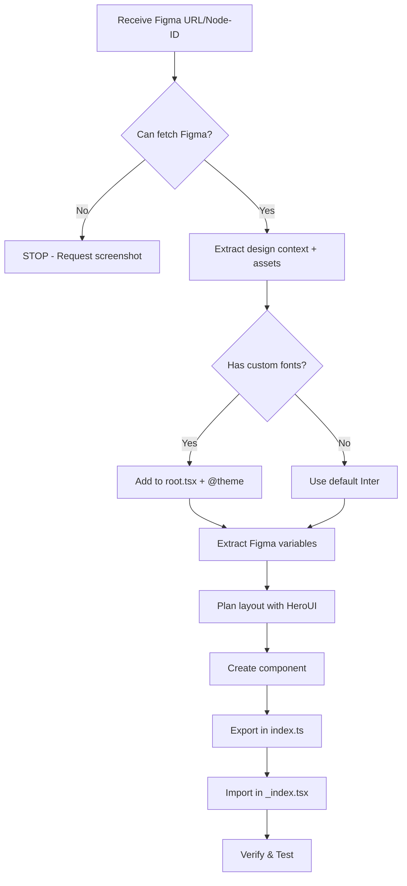

# FIGMA TO CODE RULES - SONNET 4.5

## 🚨 CORE RULES (MUST FOLLOW)

### 1. NO CODE WITHOUT FIGMA DATA
- ❌ If Figma fetch fails → STOP immediately
- ❌ NO guessing/assumptions about colors, spacing, typography
- ✅ Show error message and wait for user to fix
- ✅ Request screenshot if Figma MCP unavailable

### 2. NO ABSOLUTE POSITIONING
- ❌ NEVER use `position: absolute`, `top`, `left`, `right`, `bottom`
- ✅ ONLY use flex/grid for layouts
- ✅ Exception: Modals/overlays with `fixed inset-0` if shown in Figma

### 3. NO INLINE STYLES
- ❌ NEVER use `style={{}}` prop
- ✅ ALWAYS use Tailwind classes only
- ✅ Use `cn()` utility for conditional classes

### 4. HEROUI COMPONENTS FIRST
- ✅ Start with HeroUI: `Button`, `Card`, `Input`, `Modal`, `Navbar`
- ✅ Extend with Tailwind for exact Figma styling
- ✅ HeroUI provides: accessibility, responsive, interactions
- ❌ DON'T build from scratch if HeroUI component exists
- 📖 Verify API at [HeroUI Docs](https://heroui.com/docs) before implementing

### 5. PREFER REACT-ICONS FOR UI ICONS
- ✅ For standard UI icons (arrows, user, home, etc.) → Use `react-icons`
- ✅ Search at [react-icons.github.io](https://react-icons.github.io/react-icons/)
- ✅ Export SVG/PNG **ONLY** for brand logos or unique illustrations
```tsx
import { FaArrowRight } from "react-icons/fa6";
<Button endContent={<FaArrowRight />}>Get Started</Button>
```

## TECH STACK
- React 19 + React Router v7 (file-based routing)
- TypeScript 5.8+ (NO `any` types)
- Tailwind CSS v4 + HeroUI v2.8+
- React Icons v5+ (for all icons)
- Framer Motion v12+ (animations)
- Valtio v2+ (state)
- xior v0.7+ (HTTP)
- Cloudflare Pages (SSR)

## WORKFLOW (FOLLOW IN ORDER)



### Phase 1: Fetch Figma Data

#### Step 1.1: Extract Node ID from URL
**Convert Figma URL to nodeId:**
```
URL: https://figma.com/design/:fileKey/:fileName?node-id=4-34960
NodeId: "4:34960"  (replace hyphen with colon)
```

#### Step 1.2: Fetch Design Context
```typescript
mcp0_get_design_context({
  nodeId: "4:34960",
  clientLanguages: "typescript",
  clientFrameworks: "react",
  // 🚨 Use actual workspace path (check Active Document or run `pwd`)
  dirForAssetWrites: "/Users/username/project/public/assets"
})
```

**You'll get:**
- Design structure (XML/JSON), CSS styles, colors, typography
- Assets exported to `public/assets/` (images, logos, custom icons)
- ❌ Standard UI icons → Use `react-icons` instead

**If fetch fails:**
1. Check Figma desktop app is running
2. Verify node-id is correct
3. Ask user for screenshot as fallback

#### Step 1.3: Extract Figma Variables (Optional)
```typescript
mcp0_get_variable_defs({ nodeId: "4:34960" })
```
Returns: `{"color/primary/500": "#0066FF", "spacing/base": "16px"}`

**Map to @theme:** Copy values → Paste into `app/app.css` → Convert to CSS variables
- Example: `"color/primary/500": "#0066FF"` → `--color-primary-500: #0066FF;`

---

### Phase 2: Configuration

#### Step 2.1: Add Google Fonts to `app/root.tsx`
**Extract font names from Figma → Add to links:**

```tsx
// app/root.tsx
export const links: Route.LinksFunction = () => [
  { rel: 'preconnect', href: 'https://fonts.googleapis.com' },
  { rel: 'preconnect', href: 'https://fonts.gstatic.com', crossOrigin: 'anonymous' },
  // Get URL from fonts.google.com
  { rel: 'stylesheet', href: 'https://fonts.googleapis.com/css2?family=Inter:wght@400;700&display=swap' },
  { rel: 'stylesheet', href: 'https://fonts.googleapis.com/css2?family=Poppins:wght@400;600;700&display=swap' },
];
```
**Note**: Search fonts at [Google Fonts](https://fonts.google.com), select weights from Figma, copy `<link>` href

#### Step 2.2: Configure Tailwind Theme in `app/app.css`
```css
@theme {
  /* Fonts - match with root.tsx (use --font-sans, NOT --font-family-sans) */
  --font-sans: "Inter", ui-sans-serif, system-ui, sans-serif;
  --font-heading: "Poppins", ui-sans-serif, system-ui, sans-serif;
  
  /* Colors from Figma */
  --color-primary: #0066FF;
  --color-primary-hover: #0052CC;
  --color-secondary: #6B7280;
  
  /* Or use color scales from Figma variables */
  --color-primary-500: #28a745;
  --color-primary-600: #21963b;
  
  /* Container widths from Figma */
  --container-xl: 1280px;
}
```

**Usage:**
```tsx
<div className="font-sans text-primary">       {/* NOT font-family-sans */}
<h1 className="font-heading">                  {/* NOT font-family-heading */}
<Button className="bg-primary hover:bg-primary-hover">
```

---

### Phase 3: Component Creation

#### Step 3.1: Plan Layout with HeroUI
**Available components:**
```tsx
import { Button, Card, Input, Modal, Navbar, Tabs } from "@heroui/react";
```

**Mapping Figma → HeroUI:**
- Buttons → `<Button>`
- Cards/Containers → `<Card>`
- Form inputs → `<Input>`, `<Checkbox>`, `<Radio>`
- Navigation → `<Navbar>`, `<Tabs>`
- Modals/Dialogs → `<Modal>`

**Icons - Use react-icons:**
- Search UI icons at [react-icons.github.io](https://react-icons.github.io)
- Import from appropriate library: `import { FaArrowRight, FaUser } from "react-icons/fa6"`
- Only export SVG for brand logos/unique illustrations

#### Step 3.2: Create Component File
**Location:** `app/components/sections/ComponentName.tsx`

```tsx
// app/components/sections/HeroSection.tsx
import { Button } from "@heroui/react";
import { FaArrowRight } from "react-icons/fa6";

export function HeroSection() {
  return (
    <section className="container py-16">
      <div className="flex flex-col items-center gap-8">
        <h1 className="text-5xl font-heading font-bold text-primary">
          {/* Extract text from Figma */}
          Welcome to Z9 Studio
        </h1>
        <Button 
          className="bg-primary hover:bg-primary-hover" 
          endContent={<FaArrowRight />}
        >
          Get Started
        </Button>
      </div>
    </section>
  );
}
```

**Naming:**
- Use `PascalCase.tsx` for component files
- Place in `app/components/sections/`
- Export named components (NOT default export)
- Use semantic names: `HeroSection`, `FeaturesSection`

**Assets:**
```tsx

```

#### Step 3.3: Export in `app/components/index.ts`
```tsx
export { HeroSection } from './sections/HeroSection';
export { FeaturesSection } from './sections/FeaturesSection';
```

---

### Phase 4: Integration

#### Step 4.1: Import and Display in `_index.tsx`
```tsx
// app/routes/_index.tsx
import type { Route } from './+types/_index';
import { HeroSection, FeaturesSection } from '~/components';

export const meta = ({}: Route.MetaArgs) => [
  { title: 'Z9 Studio' },
  { name: 'description', content: 'Welcome to Z9 Studio!' }
];

export default function Home({ loaderData }: Route.ComponentProps) {
  return (
    <>
      <HeroSection />
      <FeaturesSection />
    </>
  );
}
```

---

### Phase 5: Verification

#### Step 5.1: Pre-flight Checklist
- [ ] Figma data fetched successfully
- [ ] Google Fonts added to `app/root.tsx`
- [ ] `@theme` configured in `app/app.css` with correct variable names
- [ ] Font names match between root.tsx and @theme
- [ ] Colors extracted from Figma (exact hex values)
- [ ] HeroUI components identified
- [ ] Assets exported to `public/assets/`

#### Step 5.2: Run Dev Server & Validate
**Commands:**
```bash
npm run dev          # Start dev server
npx tsc --noEmit     # TypeScript validation
```

**Check:**
- [ ] Fonts load correctly (inspect in DevTools)
- [ ] Layout matches Figma visually
- [ ] No console errors
- [ ] No TypeScript errors
- [ ] No `any` types used
- [ ] Responsive on mobile (320px), tablet (768px), desktop (1024px+)

**Visual comparison:**
1. Take screenshot from Figma
2. Open dev server in browser
3. Use overlay comparison or side-by-side
4. Check pixel-perfect alignment

#### Step 5.3: Accessibility Audit
**Tools:** Browser DevTools → Lighthouse, [WebAIM Contrast Checker](https://webaim.org/resources/contrastchecker/)

**Checklist:**
- [ ] Color contrast ≥4.5:1 for text
- [ ] All interactive elements have focus states
- [ ] Semantic HTML used (`nav`, `main`, `article`, `section`)
- [ ] ARIA labels on icons/buttons
- [ ] Keyboard navigation works (Tab, Enter, Escape)

---

## TROUBLESHOOTING

### Fonts not loading
**Symptoms:** Text shows default system font

**Solutions:**
1. Verify Google Fonts links in `app/root.tsx` 
2. Check `@theme` has correct font names: `--font-sans` (NOT `--font-family-sans`)
3. Ensure font names match exactly between root.tsx and @theme
4. Clear browser cache (Cmd+Shift+R / Ctrl+Shift+R)
5. Check Network tab - fonts should load from googleapis.com

### Colors don't match Figma
**Solutions:**
1. Use Figma's color picker (NOT browser eyedropper)
2. Verify `@theme` variables match exactly (case-sensitive)
3. Check using custom tokens: `bg-primary` (NOT `bg-[#0066FF]`)
4. Verify no inline styles or hardcoded colors

### Layout broken on mobile
**Solutions:**
1. Verify using `flex` or `grid` (NOT absolute positioning)
2. Add responsive breakpoints: `md:`, `lg:`
3. Check padding: `px-4 md:px-6 lg:px-8`
4. Test at actual viewports: 320px, 768px, 1024px

### Assets/images not showing
**Solutions:**
1. Verify `dirForAssetWrites` path was set correctly in Figma MCP call
2. Check assets exist in `public/assets/` folder
3. Use correct path: `/assets/image.png` (NOT `./assets/`)
4. Verify image file extensions match (case-sensitive)

### HeroUI components not working
**Solutions:**
1. Check HeroUI version: `npm ls @heroui/react`
2. Verify import: `import { Button } from "@heroui/react"`
3. Check [HeroUI Docs](https://heroui.com/docs) for correct API
4. Ensure `<HeroUIProvider>` wraps app in `root.tsx`

### TypeScript errors
**Solutions:**
1. Run `npx tsc --noEmit` to see all errors
2. Add proper type annotations (NO `any`)
3. Import types: `import type { Route } from './+types/_index'`
4. Check props interface naming: `{Component}Props`

### Can't find specific icon
**Solutions:**
1. Search synonyms (e.g., "user" → "person", "account")
2. Check different icon sets (Fa, Md, Hi, Lu)
3. Use `Lu` (Lucide) or `Hi` (Heroicons) for modern look
4. ONLY export as SVG if absolutely unique (brand logo)

---

## QUALITY CHECKLIST

### Visual & Layout
- [ ] Pixel-perfect match with Figma
- [ ] Fonts load and display correctly
- [ ] Colors match exactly
- [ ] Spacing matches Figma measurements
- [ ] Responsive on all breakpoints

### Interactivity
- [ ] All interactive elements have hover/focus/active states
- [ ] Transitions smooth (duration-200)
- [ ] Loading states for async operations
- [ ] Error states with retry functionality

### Performance
- [ ] Images optimized (WebP format, lazy loading)
- [ ] Images have width/height attributes
- [ ] No layout shift (CLS score)
- [ ] Assets < 100KB for hero, < 50KB for thumbnails

### Accessibility
- [ ] Keyboard navigation works
- [ ] Screen reader friendly (ARIA labels, semantic HTML)
- [ ] Color contrast ≥4.5:1 for text
- [ ] Focus visible on all interactive elements

### Code Quality
- [ ] TypeScript no errors/warnings
- [ ] NO `any` types used
- [ ] NO absolute positioning
- [ ] NO inline styles
- [ ] Using HeroUI components where applicable
- [ ] Using custom tokens (NOT hardcoded values)
- [ ] NO console errors in browser

---

## REMEMBER

1. **Figma First**: Never code without Figma data
2. **Setup First**: Configure fonts & theme before components
3. **HeroUI First**: Always check if component exists
4. **Custom Tokens**: Use `bg-primary`, `font-heading` (NOT hardcoded)
5. **Variable Names**: Use `--font-sans` (NOT `--font-family-sans`)
6. **Asset Paths**: Use `/assets/` from `public/assets/` folder
7. **Icons**: Prefer `react-icons` for UI, export SVG only for brand logos
8. **Match 100%**: Code must match Figma exactly
9. **Mobile-First**: Responsive classes on everything
10. **TypeScript Strict**: NO `any` types allowed

---

## REFERENCE - CODE STANDARDS

### Naming Quick Reference
**Files:**
- Routes: `kebab-case.tsx` (e.g., `user-profile.tsx`)
- Components: `PascalCase.tsx` (e.g., `HeroSection.tsx`)
- Utils: `kebab-case.ts` (e.g., `format-date.ts`)
- Hooks: `camelCase.ts` (e.g., `useAuth.ts`)
- Stores: `kebab-case.ts` (e.g., `auth-store.ts`)

**Code:**
- Components: `PascalCase` (e.g., `UserProfile`)
- Props: `{Component}Props` (e.g., `UserProfileProps`)
- Variables: `camelCase` (e.g., `userName`)
- Booleans: `is/has/should/can` prefix (e.g., `isLoading`)
- Functions: `camelCase` + verb (e.g., `getUserData`)
- Event handlers: `handle{Event}` (e.g., `handleClick`)
- Constants: `UPPER_SNAKE_CASE` (e.g., `API_BASE_URL`)
- Hooks: `use{Name}` (e.g., `useAuth`)
- Stores: `camelCase` + `Store` (e.g., `authStore`)

### Responsive Design Patterns
```tsx
// Mobile-first Tailwind classes
<div className="flex flex-col md:flex-row lg:gap-8">
  <h1 className="text-2xl md:text-4xl lg:text-5xl">Title</h1>
</div>

// Responsive spacing
<section className="py-8 md:py-12 lg:py-16">
  <div className="px-4 md:px-6 lg:px-8">
    <div className="grid grid-cols-1 md:grid-cols-2 lg:grid-cols-3 gap-4 md:gap-6">
```

### Animations (Framer Motion)
**🚨 ONLY add if shown in Figma**

```tsx
import { motion } from 'framer-motion';

// Button hover/tap
<motion.button
  whileHover={{ scale: 1.05 }}
  whileTap={{ scale: 0.95 }}
  transition={{ type: "spring", stiffness: 400 }}
>
  Button
</motion.button>

// Page transitions
<motion.div
  initial={{ opacity: 0, y: 20 }}
  animate={{ opacity: 1, y: 0 }}
  transition={{ duration: 0.3 }}
>
  Content
</motion.div>
```

### State Management (Valtio)
```tsx
import { proxy, useSnapshot } from 'valtio';

// Create store
export const store = proxy({
  isMenuOpen: false,
  toggle() { this.isMenuOpen = !this.isMenuOpen; }
});

// Use in component
function Component() {
  const snap = useSnapshot(store);
  return <div>{snap.isMenuOpen && <Menu />}</div>;
}
```

### Detailed Design Rules

#### Spacing & Layout
- Use consistent spacing scale: 4, 8, 12, 16, 24, 32, 48, 64px
- Maintain vertical rhythm with gap utilities
- Use `space-y-*` for vertical stacks, `gap-*` for flex/grid
- Container padding: `px-4 md:px-6 lg:px-8`

#### Typography Hierarchy
- Clear size progression: h1 > h2 > h3 > body > small
- Line-height: 1.2 for headings, 1.6 for body
- Letter-spacing: tighter for headings, normal for body
- Font weights: Bold (700) headings, Regular (400) body
```tsx
<h1 className="text-5xl md:text-6xl font-bold leading-tight tracking-tight">
<p className="text-base md:text-lg leading-relaxed">
```

#### Micro-interactions
- Add hover states to ALL interactive elements
- Use `transition-all duration-200` for smooth effects
- Focus states: `focus:ring-2 focus:ring-primary`
- Disabled states: `disabled:opacity-50 disabled:cursor-not-allowed`
```tsx
<Button 
  className="
    bg-primary hover:bg-primary-hover 
    hover:scale-105 hover:shadow-lg
    active:scale-95
    transition-all duration-200
    focus:ring-2 focus:ring-primary focus:ring-offset-2
  "
>
  Click Me
</Button>
```

#### Images & Assets
- Use WebP format with PNG/JPG fallback
- Add `loading="lazy"` for images below fold
- Use `width` and `height` attributes (prevent layout shift)
- Optimize images: max 100KB for hero, 50KB for thumbnails
```tsx
<picture>
  <source srcset="/assets/hero-mobile.webp" media="(max-width: 768px)" />
  <source srcset="/assets/hero-desktop.webp" media="(min-width: 769px)" />
  
</picture>
```

#### Carousel Implementation
**Auto-detect from Figma:**
- If Figma has arrow icons (← →) near content → Implement carousel
- If Figma shows horizontal scrollable content → Implement carousel
- Use `embla-carousel-react` (already in dependencies)

#### Tailwind Best Practices
- Prefer standard classes: `text-xl` instead of `text-[20px]`
- Use `p-4 m-6` instead of `p-[16px] m-[24px]`
- Use `bg-blue-500` instead of `bg-[#3B82F6]`
- Use brackets `[]` ONLY for non-standard Figma values
