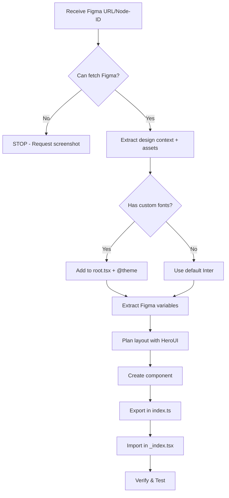

# FIGMA TO CODE RULES - SONNET 4.5

## 🚨 CRITICAL RULES (MUST FOLLOW)

### 1. NO CODE WITHOUT FIGMA DATA
- ❌ If Figma fetch fails → STOP immediately
- ❌ NO guessing/assumptions about colors, spacing, typography
- ✅ Show error message and wait for user to fix
- ✅ Request screenshot if Figma MCP unavailable

### 2. NO ABSOLUTE POSITIONING
- ❌ NEVER use `position: absolute`, `top`, `left`, `right`, `bottom`
- ✅ ONLY use flex/grid for layouts
- ✅ Exception: Modals/overlays with `fixed inset-0` if shown in Figma

### 3. NO INLINE STYLES
- ❌ NEVER use `style={{}}` prop
- ✅ ALWAYS use Tailwind classes only
- ✅ Use `cn()` utility for conditional classes

### 4. PREFER STANDARD TAILWIND CLASSES
- ✅ Use `text-xl` instead of `text-[20px]`
- ✅ Use `p-4 m-6` instead of `p-[16px] m-[24px]`
- ✅ Use `bg-blue-500` instead of `bg-[#3B82F6]`
- ✅ Use brackets `[]` ONLY for non-standard Figma values

### 5. ALWAYS USE HEROUI COMPONENTS FOR LAYOUT
- ✅ Start with HeroUI: `Button`, `Card`, `Input`, `Modal`, `Navbar`
- ✅ Extend with Tailwind for exact Figma styling
- ✅ HeroUI provides: accessibility, responsive, interactions
- ❌ DON'T build from scratch if HeroUI component exists
- 📖 Verify API at [HeroUI Docs](https://heroui.com/docs) before implementing

### 6. IMAGES & ASSETS OPTIMIZATION
- ✅ Use WebP format with PNG/JPG fallback
- ✅ Add `loading="lazy"` for images below fold
- ✅ Use `width` and `height` attributes (prevent layout shift)
- ✅ Optimize images: max 100KB for hero, 50KB for thumbnails
- ✅ Use `<picture>` for responsive images
```tsx
<picture>
  <source srcset="/assets/hero-mobile.webp" media="(max-width: 768px)" />
  <source srcset="/assets/hero-desktop.webp" media="(min-width: 769px)" />
  
</picture>
```

### 7. MICRO-INTERACTIONS & POLISH
- ✅ Add hover states to ALL interactive elements
- ✅ Use `transition-all duration-200` for smooth effects
- ✅ Add focus states: `focus:ring-2 focus:ring-primary`
- ✅ Disabled states: `disabled:opacity-50 disabled:cursor-not-allowed`
- ✅ Loading states: Show spinners or skeleton loaders
```tsx
<Button 
  className="
    bg-primary hover:bg-primary-hover 
    hover:scale-105 hover:shadow-lg
    active:scale-95
    transition-all duration-200
    focus:ring-2 focus:ring-primary focus:ring-offset-2
  "
>
  Click Me
</Button>
```

### 8. SPACING & LAYOUT CONSISTENCY
- ✅ Use consistent spacing scale: 4, 8, 12, 16, 24, 32, 48, 64px
- ✅ Maintain vertical rhythm with gap utilities
- ✅ Use `space-y-*` for vertical stacks
- ✅ Use `gap-*` for flex/grid layouts
- ✅ Container padding: `px-4 md:px-6 lg:px-8`

### 9. TYPOGRAPHY HIERARCHY
- ✅ Clear size progression: h1 > h2 > h3 > body > small
- ✅ Consistent line-height: 1.2 for headings, 1.6 for body
- ✅ Letter-spacing: tighter for headings, normal for body
- ✅ Font weights: Bold (700) headings, Regular (400) body
```tsx
<h1 className="text-5xl md:text-6xl font-bold leading-tight tracking-tight">
<h2 className="text-3xl md:text-4xl font-bold leading-tight">
<p className="text-base md:text-lg leading-relaxed">
```

### 10. CAROUSEL DETECTION & IMPLEMENTATION
**🚨 AUTO-DETECT CAROUSEL FROM FIGMA:**
- ✅ If Figma has arrow icons (← →) near content → Implement carousel
- ✅ If Figma shows horizontal scrollable content → Implement carousel
- ✅ Use `embla-carousel-react` (already in dependencies)
- ✅ Add prev/next buttons with arrow icons from Figma

## TECH STACK
- React 19 + React Router v7 (file-based routing)
- TypeScript 5.8+ (NO `any` types)
- Tailwind CSS v4 + HeroUI v2.8+
- Framer Motion v12+ (animations)
- Valtio v2+ (state)
- xior v0.7+ (HTTP)
- Cloudflare Pages (SSR)

## COMPLETE WORKFLOW (FOLLOW IN ORDER)



### Phase 1: Preparation & Figma Data Extraction

#### Step 1.1: Extract Figma Node ID from URL
**URL formats:**
```
Design file: https://figma.com/design/:fileKey/:fileName?node-id=1-2
Board file:  https://figma.com/board/:fileKey/:fileName?node-id=1-2
```

**Convert node-id to nodeId:**
- URL format: `node-id=1-2` (hyphen)
- Tool format: `nodeId: "1:2"` (colon)
- Example: `node-id=4-34960` → `nodeId: "4:34960"`

#### Step 1.2: Fetch Figma Design Context
**Use Figma MCP tool:**

```typescript
mcp0_get_design_context({
  nodeId: "4:34960",  // Required: extracted from URL
  clientLanguages: "typescript",
  clientFrameworks: "react",
  // 🚨 MUST use actual absolute path (run `pwd` to find root)
  // Example: "/Users/username/projects/my-app/public/assets"
  dirForAssetWrites: "/Users/hungvn6.sc/github/mine/react-router-vite-cfp-heroui/public/assets"
})
```

**What you'll get:**
- Design structure (XML or JSON)
- CSS styles and measurements
- Color values, typography specs
- Export assets (images, logos, custom icons) → saved to `public/assets/`
- ❌ Standard UI icons → Use `react-icons` instead

**If fetch fails:**
1. Check Figma desktop app is running
2. Verify node-id is correct
3. Ask user for screenshot as fallback

#### Step 1.3: Extract Figma Variables (Optional)
**If design uses Figma variables/tokens:**

```typescript
mcp0_get_variable_defs({
  nodeId: "4:34960"
})
```

**You'll get:**
```json
{
  "color/primary/500": "#0066FF",
  "spacing/base": "16px",
  "font/family/heading": "Poppins"
}
```

**Map to @theme later** in Step 2.2
- Copy values from JSON output
- Paste into `app/app.css` under `@theme`
- Example: `"color/primary/500": "#0066FF"` → `--color-primary-500: #0066FF;`

---

### Phase 2: Configuration

#### Step 2.1: Configure Google Fonts in Root (`app/root.tsx`)
**🚨 IMPORTANT: Add fonts BEFORE creating components**

**Get font families from Figma design context:**
- Check typography section for font names
- Note all unique font families used

**Add to root.tsx:**
```tsx
// app/root.tsx
export const links: Route.LinksFunction = () => [
  { rel: 'preconnect', href: 'https://fonts.googleapis.com' },
  {
    rel: 'preconnect',
    href: 'https://fonts.gstatic.com',
    crossOrigin: 'anonymous',
  },
  // ✅ Add your Google Fonts here (from Figma design)
  {
    rel: 'stylesheet',
    href: 'https://fonts.googleapis.com/css2?family=Inter:ital,opsz,wght@0,14..32,100..900;1,14..32,100..900&display=swap',
  },
  // ✅ Add additional fonts if needed
  {
    rel: 'stylesheet',
    href: 'https://fonts.googleapis.com/css2?family=Poppins:wght@400;500;600;700&display=swap',
  },
];
```

**How to get Google Font URLs:**
1. Go to [Google Fonts](https://fonts.google.com)
2. Select font families found in Figma
3. Select weights needed (check Figma design for font-weight values)
4. Copy `<link>` href URL
5. Add to `links` function

#### Step 2.2: Configure Tailwind Theme (`app/app.css`)
**Extract tokens from Figma and configure:**

```css
@theme {
  /* ✅ Fonts - match with root.tsx (use --font-sans, NOT --font-family-sans) */
  --font-sans: "Inter", ui-sans-serif, system-ui, sans-serif;
  --font-heading: "Poppins", ui-sans-serif, system-ui, sans-serif;
  
  /* ✅ Colors from Figma - exact hex values */
  --color-primary: #0066FF;           /* Main brand color */
  --color-primary-hover: #0052CC;     /* Hover state (darker) */
  --color-secondary: #6B7280;
  --color-accent: #FF6B35;
  --color-success: #10B981;
  --color-danger: #EF4444;
  
  /* ✅ Or use color scales from Figma variables */
  --color-primary-50: #f0faf6;
  --color-primary-100: #e4f7ef;
  --color-primary-500: #28a745;       /* Main */
  --color-primary-600: #21963b;       /* Hover */
  --color-primary-950: #03300a;
  
  /* ✅ Container max-widths from Figma */
  --container-sm: 640px;
  --container-md: 768px;
  --container-lg: 1024px;
  --container-xl: 1280px;
  --container-2xl: 1536px;
  
  /* ✅ Spacing from Figma (if custom) */
  --spacing-xs: 4px;
  --spacing-sm: 8px;
  --spacing-md: 16px;
  --spacing-lg: 24px;
  --spacing-xl: 32px;
}
```

**Usage in components:**
```tsx
<div className="font-sans text-primary">      {/* NOT font-family-sans */}
<h1 className="font-heading">                 {/* NOT font-family-heading */}
<Button className="bg-primary hover:bg-primary-hover">
```

---

### Phase 3: Component Creation

#### Step 3.1: Plan Layout with HeroUI Components
**🚨 ALWAYS check HeroUI first:**

**Available HeroUI components:**
```tsx
import { 
  Button, Card, Input, Modal, Navbar,
  Divider, Chip, Avatar, Dropdown, Tabs,
  Accordion, Badge, Checkbox, Radio, Switch
} from "@heroui/react";
```

**Mapping Figma → HeroUI:**
- Buttons → `<Button>`
- Cards/Containers → `<Card>`
- Form inputs → `<Input>`, `<Checkbox>`, `<Radio>`
- Navigation → `<Navbar>`, `<Tabs>`
- Modals/Dialogs → `<Modal>`

**Extend with Tailwind for exact match:**
```tsx
<Button 
  className="bg-primary hover:bg-primary-hover px-6 py-3"
  radius="lg"
  size="lg"
>
  Click Me
</Button>

<Card className="p-8 shadow-lg rounded-2xl">
  <Card.Header>
    <h3 className="text-2xl font-heading font-bold text-primary">Title</h3>
  </Card.Header>
  <Card.Body>
    <p className="text-base text-secondary leading-relaxed">Content</p>
  </Card.Body>
</Card>
```

#### Step 3.2: Create Component in `app/components/sections/`
**Component structure:**

```tsx
// app/components/sections/HeroSection.tsx
import { Button } from "@heroui/react";

export function HeroSection() {
  return (
    <section className="container py-16">
      <div className="flex flex-col items-center gap-8">
        {/* ✅ Extract text from Figma - DON'T use hardcoded values */}
        <h1 className="text-5xl font-heading font-bold text-primary">
          {/* Text from Figma design */}
          Welcome to Z9 Studio
        </h1>
        <Button className="bg-primary hover:bg-primary-hover">
          Get Started
        </Button>
      </div>
    </section>
  );
}
```

**File naming & location:**
- ✅ Use `PascalCase.tsx` for component files
- ✅ Place in `app/components/sections/` folder
- ✅ Export named components (NOT default export)
- ✅ Use semantic section names: `HeroSection`, `FeaturesSection`, `TestimonialsSection`

**Asset references:**
```tsx
// ✅ Assets from Figma are in public/assets/


// ✅ Use picture for responsive
<picture>
  <source srcset="/assets/hero-mobile.webp" media="(max-width: 768px)" />
  
</picture>
```

#### Step 3.3: Export Components (`app/components/index.ts`)
**Create central export point:**

```tsx
// app/components/index.ts
export { HeroSection } from './sections/HeroSection';
export { WhatYouWillGet } from './sections/WhatYouWillGet';
export { LatestBooks } from './sections/LatestBooks';
export { Footer } from './sections/Footer';
```

---

### Phase 4: Integration

#### Step 4.1: Import and Display in `_index.tsx`
**Compose sections in home page:**

```tsx
// app/routes/_index.tsx
import type { Route } from './+types/_index';
import { HeroSection, WhatYouWillGet, LatestBooks, Footer } from '~/components';

export const meta = ({}: Route.MetaArgs) => [
  { title: 'Z9 Studio' },
  { name: 'description', content: 'Welcome to Z9 Studio!' }
];

export default function Home({ loaderData }: Route.ComponentProps) {
  return (
    <>
      <HeroSection />
      <WhatYouWillGet />
      <LatestBooks />
      <Footer />
    </>
  );
}
```

**✅ Import path:** Use `~/components` (alias) instead of relative paths

---

### Phase 5: Verification & Testing

#### Step 5.1: Pre-flight Checklist
**Before coding:**
- [ ] Figma data fetched successfully
- [ ] Google Fonts added to `app/root.tsx`
- [ ] `@theme` configured in `app/app.css` with correct variable names
- [ ] Font names match between root.tsx and @theme
- [ ] Colors extracted from Figma (exact hex values)
- [ ] Container widths configured
- [ ] HeroUI components identified
- [ ] Assets exported to `public/assets/`

#### Step 5.2: Run Development Server
```bash
npm run dev
# or
pnpm dev
```

**Check:**
- [ ] Fonts load correctly (inspect in DevTools)
- [ ] Layout matches Figma visually
- [ ] No console errors

#### Step 5.3: TypeScript Validation
```bash
npx tsc --noEmit
```

- [ ] No TypeScript errors
- [ ] No `any` types used
- [ ] All props typed correctly

#### Step 5.4: Accessibility Audit
**Tools:**
- Browser DevTools → Lighthouse
- [WebAIM Contrast Checker](https://webaim.org/resources/contrastchecker/)
- axe DevTools extension

**Checklist:**
- [ ] Color contrast ≥4.5:1 for text
- [ ] All interactive elements have focus states
- [ ] Semantic HTML used (`nav`, `main`, `article`, `section`)
- [ ] ARIA labels on icons/buttons
- [ ] Keyboard navigation works (Tab, Enter, Escape)

#### Step 5.5: Responsive Testing
**Viewports to test:**
- [ ] Mobile: 320px, 375px, 414px
- [ ] Tablet: 768px, 834px
- [ ] Desktop: 1024px, 1280px, 1920px

**Commands:**
```tsx
// Use media query hook for conditional rendering
import { useMediaQuery } from '@mantine/hooks';
const isMobile = useMediaQuery('(max-width: 768px)');
```

#### Step 5.6: Visual Comparison
**Use browser tool to compare:**
1. Take screenshot from Figma
2. Open dev server in browser
3. Use overlay comparison or side-by-side
4. Check pixel-perfect alignment

---

## RESPONSIVE DESIGN

```tsx
// ✅ Mobile-first Tailwind classes
<div className="flex flex-col md:flex-row lg:gap-8">
  <h1 className="text-2xl md:text-4xl lg:text-5xl">Title</h1>
</div>

// ✅ Responsive spacing
<section className="py-8 md:py-12 lg:py-16">
  <div className="px-4 md:px-6 lg:px-8">
    <div className="grid grid-cols-1 md:grid-cols-2 lg:grid-cols-3 gap-4 md:gap-6">
```

---

## ANIMATIONS (Framer Motion)

**🚨 ONLY add animations if shown in Figma**

```tsx
import { motion } from 'framer-motion';

// ✅ Button hover/tap
<motion.button
  whileHover={{ scale: 1.05 }}
  whileTap={{ scale: 0.95 }}
  transition={{ type: "spring", stiffness: 400 }}
>
  Button
</motion.button>

// ✅ Page transitions
<motion.div
  initial={{ opacity: 0, y: 20 }}
  animate={{ opacity: 1, y: 0 }}
  exit={{ opacity: 0, y: -20 }}
  transition={{ duration: 0.3 }}
>
  Content
</motion.div>
```

---

## STATE MANAGEMENT (Valtio)

```tsx
import { proxy, useSnapshot } from 'valtio';

// ✅ Create store
export const store = proxy({
  isMenuOpen: false,
  toggle() { this.isMenuOpen = !this.isMenuOpen; }
});

// ✅ Use in component
function Component() {
  const snap = useSnapshot(store);
  return <div>{snap.isMenuOpen && <Menu />}</div>;
}
```

---

## NAMING CONVENTIONS

### Files & Folders
| Type | Convention | Example |
| ---- | ---------- | ------- |
| Route files | `kebab-case.tsx` | `login.tsx`, `user-profile.tsx` |
| Component files | `PascalCase.tsx` | `UserCard.tsx`, `LoginForm.tsx` |
| Section components | `PascalCase.tsx` | `HeroSection.tsx`, `FeaturesSection.tsx` |
| Utility files | `kebab-case.ts` | `format-date.ts`, `api-client.ts` |
| Hook files | `camelCase.ts` | `useAuth.ts`, `useDebounce.ts` |
| Store files | `kebab-case.ts` | `auth-store.ts`, `user-store.ts` |
| Folders | `kebab-case` | `user-profile/`, `sections/` |

### Code Naming
| Type | Convention | Example |
| ---- | ---------- | ------- |
| Components | `PascalCase` | `UserProfile`, `HeroSection` |
| Props interface | `{Component}Props` | `UserProfileProps` |
| Variables | `camelCase` | `userName`, `fetchData` |
| Boolean vars | `is/has/should/can` | `isLoading`, `hasPermission` |
| Functions | `camelCase` + verb | `getUserData`, `formatDate` |
| Event handlers | `handle{Event}` | `handleClick`, `handleSubmit` |
| Constants | `UPPER_SNAKE_CASE` | `API_BASE_URL`, `MAX_RETRY` |
| Custom hooks | `use{Name}` | `useAuth`, `useLocalStorage` |
| Stores | `camelCase` + `Store` | `authStore`, `userStore` |

---

## TROUBLESHOOTING

### Issue: Fonts not loading
**Symptoms:** Text shows default system font instead of custom fonts

**Solutions:**
1. ✅ Verify Google Fonts links in `app/root.tsx` 
2. ✅ Check `@theme` has correct font names: `--font-sans` (NOT `--font-family-sans`)
3. ✅ Ensure font names match exactly between root.tsx and @theme
4. ✅ Clear browser cache and hard reload (Cmd+Shift+R / Ctrl+Shift+R)
5. ✅ Check Network tab in DevTools - fonts should load from googleapis.com

### Issue: Colors don't match Figma
**Symptoms:** Wrong colors, different shades

**Solutions:**
1. ✅ Use Figma's built-in color picker (NOT browser eyedropper)
2. ✅ Verify `@theme` variables match exactly (case-sensitive)
3. ✅ Check using custom tokens: `bg-primary` (NOT `bg-[#0066FF]`)
4. ✅ Verify no inline styles or hardcoded colors
5. ✅ Check if Figma uses opacity/blend modes

### Issue: Layout broken on mobile
**Symptoms:** Content overflow, misaligned elements

**Solutions:**
1. ✅ Verify using `flex` or `grid` (NOT absolute positioning)
2. ✅ Add responsive breakpoints: `md:`, `lg:`
3. ✅ Test with container: `<div className="container">`
4. ✅ Check padding: `px-4 md:px-6 lg:px-8`
5. ✅ Test at actual viewports: 320px, 768px, 1024px

### Issue: Assets/images not showing
**Symptoms:** Broken image icons, 404 errors

**Solutions:**
1. ✅ Verify `dirForAssetWrites` path was set correctly in Figma MCP call
2. ✅ Check assets exist in `public/assets/` folder
3. ✅ Use correct path: `/assets/image.png` (NOT `./assets/` or `../public/`)
4. ✅ Verify image file extensions match (case-sensitive)

### Issue: HeroUI components not working
**Symptoms:** Component doesn't render, props not working

**Solutions:**
1. ✅ Check HeroUI version: `npm ls @heroui/react`
2. ✅ Verify import: `import { Button } from "@heroui/react"`
3. ✅ Check [HeroUI Docs](https://heroui.com/docs) for correct API
4. ✅ Ensure `<HeroUIProvider>` wraps app in `root.tsx`

### Issue: TypeScript errors
**Symptoms:** Red squiggles, type errors

**Solutions:**
1. ✅ Run `npx tsc --noEmit` to see all errors
2. ✅ Add proper type annotations (NO `any`)
3. ✅ Import types: `import type { Route } from './+types/_index'`
4. ✅ Check props interface naming: `{Component}Props`

---

## QUALITY CHECKLIST (BEFORE DELIVERY)

### Visual & Layout
- [ ] ✅ Pixel-perfect match with Figma (use overlay comparison)
- [ ] ✅ Fonts load and display correctly
- [ ] ✅ Colors match exactly (verified with color picker)
- [ ] ✅ Spacing matches Figma measurements
- [ ] ✅ Responsive on all breakpoints (320px, 768px, 1024px+)

### Interactivity
- [ ] ✅ All interactive elements have hover/focus/active states
- [ ] ✅ Transitions smooth (duration-200)
- [ ] ✅ Loading states for async operations
- [ ] ✅ Error states with retry functionality
- [ ] ✅ Empty states with helpful messages

### Performance
- [ ] ✅ Images optimized (WebP format, lazy loading)
- [ ] ✅ Images have width/height attributes
- [ ] ✅ No layout shift (CLS score)
- [ ] ✅ Assets < 100KB for hero, < 50KB for thumbnails

### Accessibility
- [ ] ✅ Keyboard navigation works (Tab, Enter, Escape)
- [ ] ✅ Screen reader friendly (ARIA labels, semantic HTML)
- [ ] ✅ Color contrast ≥4.5:1 for text
- [ ] ✅ Focus visible on all interactive elements
- [ ] ✅ Skip to content link for screen readers

### Code Quality
- [ ] ✅ TypeScript no errors/warnings (`npx tsc --noEmit`)
- [ ] ✅ NO `any` types used
- [ ] ✅ NO absolute positioning
- [ ] ✅ NO inline styles
- [ ] ✅ Using HeroUI components where applicable
- [ ] ✅ Using custom tokens (NOT hardcoded values)
- [ ] ✅ NO console errors in browser
- [ ] ✅ Naming conventions followed

---

## REMEMBER

1. **Figma First**: Never code without Figma data
2. **Setup First**: Configure fonts & theme before components
3. **HeroUI First**: Always check if component exists
4. **Custom Tokens**: Use `bg-primary`, `font-heading` (NOT hardcoded)
5. **Variable Names**: Use `--font-sans` (NOT `--font-family-sans`)
6. **Asset Paths**: Use `/assets/` from `public/assets/` folder
7. **Match 100%**: Code must match Figma exactly
8. **No Assumptions**: All values from Figma only
9. **Mobile-First**: Responsive classes on everything
10. **TypeScript Strict**: NO `any` types allowed
